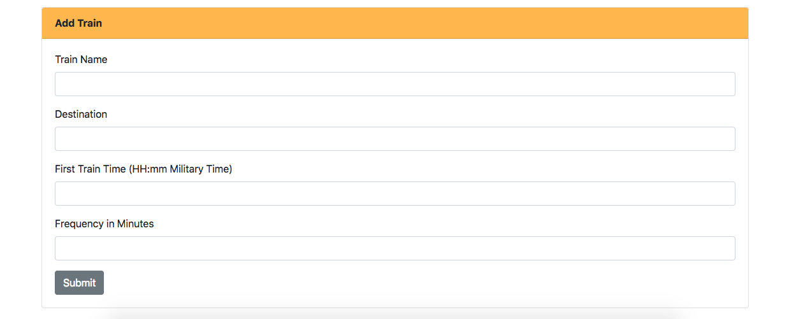

This is a train schedule application built during the UC Davis Coding Bootcamp. The requirements for this assignment include the following: 

1. Data should be stored in Firebase and persistent
2. Users should be able to add: train name, destination, first train time, and frequency
3. The next train arrival time should be calculated alongside the amount of minutes intil the next train

Technologies used: HTML/CSS, Bootstrap, JavaScript, JQuery, Firebase, Moment.js

Skills used: become familiar with new tool (moment.js), create reusable data stored remotely (Firebase)

Challenges I faced:

1. Determining whether or not there were redundancies in the code given that information had to be pushed to Firebase, stored, and updated. 
2. Understand the purpose and methods of Moment.js. This required more than reading the documentation. Additional research online had to be done to determine how to tackle this specific use case. 

[Use the application here](https://falondarville.github.io/trainSchedule/)